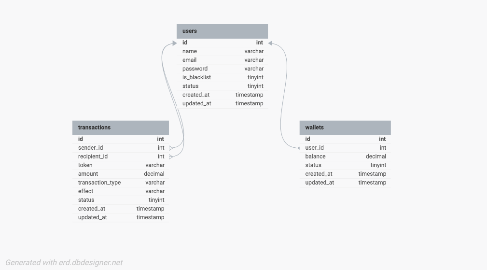

# MVP Wallet Service

A simple wallet service API that allows users to create accounts, deposit funds, transfer funds, and withdraw funds. This project is being built as part of an MVP to demonstrate basic wallet functionality.

## Features:
- User account creation
- Fund deposit and withdrawal
- Transfer funds between users
- Prevent onboarding of users that are blacklisted on Lendsqr karma blacklist

## Technologies Used:
- NodeJS (LTS version)
- MySQL database
- KnexJS ORM
- TypeScript

## Database Design

### Entity-Relationship Diagram



## Accessing the API Endpoints:

Base URL

https://oluwaseun-lendsqr-be-test.heroku.com

### User

- **GET** `/users` - Retrieve all users

- **POST** `/users` - Registers all users provided they are not blacklisted
- Body:
```json
{
  "name": "newuser",
  "email": "newuser@gmail.com",
  "password": "password"
}
```

### Wallet

- GET /wallets
- POST /wallets

Transaction

- GET /transactions
- POST /deposit-withdrawal

## Testing
```bash
   npm test